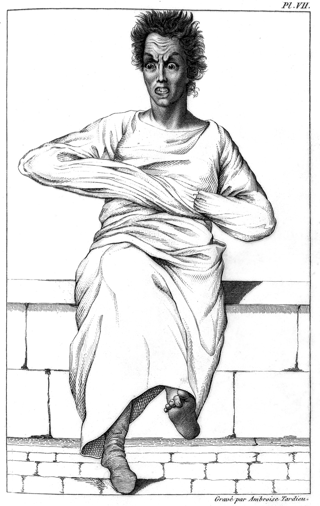

# straitjacket

<p align="center">
  
  <br>
  <em><sub>Insane patient in a strait-waistcoat. Wellcome Collection (L0011301), <a href="https://creativecommons.org/licenses/by/4.0">CC BY 4.0</a>, via <a href="https://commons.wikimedia.org/wiki/File:Insane_patient_in_a_strait-waistcoat._Wellcome_L0011301.jpg">Wikimedia Commons</a>.</sub></em>
</p>

<p align="center">
  <a href="https://crates.io/crates/straitjacket"></a>
  <a href="LICENSE"></a>
  <a href="https://straitjacket.dev"></a>
</p>

Straitjacket is a fast, deterministic scanner that flags the weird code and text LLMs
produce. It sweeps your files against a set of configurable rules and flags anything it finds.

Full documentation lives at **[straitjacket.dev](https://straitjacket.dev)**.

```sh
# quick start (Linux x86_64/aarch64, macOS arm64/x86_64):
curl -LsSf https://raw.githubusercontent.com/PowderworksCode/straitjacket/main/install.sh | sh
straitjacket
```

```text
src/theme/button.css:12:14  [color]  #ff6600
  hardcoded color literal
  help: use a theme token or CSS variable
straitjacket: 1 error(s), 0 warning(s) across 84 file(s); 0 suppressed
```

The process exits `0` when clean, `1` for error-level findings, and `2` for a
configuration or operational failure. `--no-fail` reports findings and exits
successfully, which is the shape for a first run against an existing repository.

## Background & philosophy

Straitjacket started life as a series of scripts, written because I got annoyed with the way Claude kept messing with
the design of interfaces, as well as with the kinds of code and text it would
output. I'd written versions of these linters across various projects over the
last few years, and I kept finding new smells as I generated more code and text
over time. Eventually I decided to bundle them all into one tool, so I wouldn't
have to keep rewriting them haphazardly all over the place — and so other people
could use it and tell me what other annoying things LLMs tend to do.

Straitjacket has become an exercise in me encoding as much of my personal tastes
as I can into deterministic checkers I can run across LLM output, hopefully
saving me the trouble of having to go "Yuck!" myself.

## Installing

`install.sh`, shown above, picks the build for your platform, checks it against
the release checksums, and puts a single binary in `~/.local/bin`. The Linux builds are
static, so one of them runs on any distribution regardless of its glibc. Set
`STRAITJACKET_INSTALL_DIR` to install somewhere else and `STRAITJACKET_VERSION`
to pin a tag instead of taking the latest.

Prebuilt archives for `x86_64` and `aarch64` on Linux and macOS, with a
`SHA256SUMS` file, are attached to [every release][releases]. To build from
source instead:

```sh
cargo install straitjacket
```

[releases]: https://github.com/PowderworksCode/straitjacket/releases

## GitHub Actions

```yaml
- uses: PowderworksCode/straitjacket@v0.1.1
```

That installs Straitjacket and scans the checked-out repository, failing the
step on any error-level finding. To send findings to GitHub code scanning
instead of only failing:

```yaml
permissions:
  contents: read
  security-events: write

steps:
  - uses: actions/checkout@v5
  - uses: PowderworksCode/straitjacket@v0.1.1
    with:
      sarif-file: straitjacket.sarif
      fail-on-findings: "false"
  - uses: github/codeql-action/upload-sarif@v3
    with:
      sarif_file: straitjacket.sarif
```

Every command-line option has an input, so a workflow configures the scan in
YAML rather than by assembling an argument string:

| input | default | meaning |
| --- | --- | --- |
| `version` | `latest` | Release tag to install, such as `v0.1.1`. |
| `paths` | `.` | Files or directories to scan. |
| `only` | none | Run only these rules. |
| `skip` | none | Disable these rules. |
| `format` | `text` | Output written to the log — `text`, `json`, or `sarif`. |
| `max-lines` | config | Maximum lines per file. `0` disables `file-size`. |
| `max-nesting` | config | Maximum indentation depth. `0` disables `deep-nesting`. |
| `no-comments` | `false` | Enable the opt-in `no-comments` rule. |
| `include-json` | `false` | Scan JSON files. |
| `no-ignore` | `false` | Scan what ignore files and the hidden-file convention exclude. |
| `config` | discovered | Use this configuration file instead of discovering one. |
| `no-config` | `false` | Ignore checked-in configuration. |
| `sarif-file` | none | Write a SARIF report to this path. |
| `fail-on-findings` | `true` | Fail the step on error-level findings. |
| `fail-on-unused-markers` | `true` | Report suppression markers that suppress nothing. |
| `token` | none | A GitHub token for the release download. Not needed for this repository, which is public. |

`paths`, `only`, and `skip` take either a list or a single line, so both of
these mean the same thing:

```yaml
- uses: PowderworksCode/straitjacket@v0.1.1
  with:
    paths: src tests
    only: color,emoji
```

```yaml
- uses: PowderworksCode/straitjacket@v0.1.1
  with:
    paths: |
      src
      tests
    only: |
      color
      emoji
```

A boolean input must be exactly `true` or `false`. `True` or `yes` is an error
rather than a silent `false`, because a scanner that quietly stops enforcing is
worse than one that fails.

The action sets an `exit-code` output — `0` clean, `1` findings, `2`
operational failure — so a later step can branch on the result even when
`fail-on-findings` is off.

## Rules

| rule | default | behavior |
| --- | --- | --- |
| `color` | on | Flags hardcoded CSS color literals. |
| `deep-nesting` | on | Flags code nested beyond eight indentation levels. |
| `emoji` | on | Flags emoji glyphs in source and Markdown. |
| `file-size` | on | Flags files over 1,500 lines. |
| `inline-font` | on | Flags literal font-family stacks, allowing tokens and CSS variables. |
| `inline-svg` | on | Flags inline SVG in component source. |
| `motion` | on | Flags ad-hoc transitions, animations, and keyframes. |
| `stray-todo` | on | Flags TODO, TBD, FIXME, and WIP markers left in comments. |
| `unused-marker` | on | Flags suppression markers that did not suppress anything. |
| `no-comments` | opt-in | Permits a 10-line file header and documentation comments, then flags ordinary comments. |

Every rule is lexical. Straitjacket reads files and applies patterns; it does
not parse, resolve types, or follow calls. That is the reason it runs on any
repository without setup, and it is also the limit of what it can tell you.

`straitjacket --list-rules` prints this table from the binary, which is the
authority if the two disagree.

## Usage

```sh
straitjacket .
straitjacket src tests --only emoji,color
straitjacket . --skip motion --max-lines 800
straitjacket . --format json
straitjacket . --sarif straitjacket.sarif
straitjacket . --no-comments
straitjacket instructions
```

The SARIF output validates against the SARIF 2.1.0 schema and is what GitHub
code scanning ingests.

`straitjacket instructions` prints a short, agent-facing description of the
policy resolved from the repository's `straitjacket.toml`, suitable for a
`CLAUDE.md`, an `AGENTS.md`, or an agent hook.

## Suppression

A rule-scoped line marker suppresses a finding on the same line:

```ts
const brand = "#ff6600"; // straitjacket-allow:color — fixed brand color
```

A file marker suppresses findings anywhere in that file:

```css
/* straitjacket-allow-file:color — this file defines the palette */
```

The bare forms suppress all applicable rules. Markers that suppress nothing are
reported by `unused-marker`; disable that check with
`--no-fail-on-unused-markers`.

## Configuration

Straitjacket discovers `straitjacket.toml` in the current directory or a
parent. Every key is optional, and the values below are the defaults:

```toml
paths = ["."]
only = []
skip = []
max-lines = 1500
file-size-exclude = []
todo-exclude = []
theme-files = []
max-nesting = 8
no-comments = false
include-json = false
no-ignore = false
no-fail = false
fail-on-unused-markers = true
```

CLI values override the file, which overrides built-in defaults. Unknown
configuration keys and unknown rule IDs are errors.

`theme-files` designates the files that are allowed to define color literals,
and `file-size-exclude` and `todo-exclude` are path prefixes those two rules
skip.

## What it scans

Straitjacket walks the given paths, honoring `.gitignore`, `.ignore`,
`.git/info/exclude`, and the hidden-file convention. `--no-ignore` turns all of
that off. `.git` is never scanned.

A file's language comes from its extension, then its whole filename, then its
`#!` line. Files in a language Straitjacket does not know are skipped, which is
how binaries and generated assets fall out without a list. JSON is known but
skipped unless `include-json` is set, because a JSON file is data far more often
than it is source.

Rules then narrow further. `color` and `motion` run wherever style values can
appear, which includes Vue, Svelte, and JSX as well as CSS; `deep-nesting` runs
only on languages that nest executable code; `emoji` runs everywhere except data
formats.

## Contributing

The most useful thing you can send is a concrete example — a pattern
Straitjacket should catch, or a false positive it shouldn't. See
[CONTRIBUTING.md](CONTRIBUTING.md) for what makes a good rule and how to run the
tests. Release-to-release changes are in [CHANGELOG.md](CHANGELOG.md).

## License

Code is [MIT](LICENSE).

The banner image (`assets/strait-waistcoat.jpg`) — *Insane patient in a
strait-waistcoat*, [Wellcome Collection](https://wellcomecollection.org/works/ckwscya3)
(L0011301) — is licensed [CC BY 4.0](https://creativecommons.org/licenses/by/4.0)
and is **not** covered by the MIT license; reuse it under its own terms.
